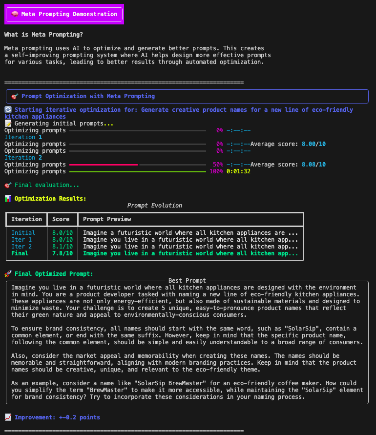

# Results of Advanced Prompting Techniques

## Chain-of-Thought (CoT)

---

## Tree-of-Thoughts (ToT)

---

## ReAct (Reason + Act)

---

## Prompt Chaining

---

## Meta Prompting

---

## RSIP (Recursive Self-Improvement Prompting)

> You can see that the after two iterations the quality score did not increase. At this point we can go with more iteration or re-evaluate the quality score function to ensure it captures the desired quality aspects.

> Even here the score stayed at 5/10 but the overall output did improve. Depending on the use case you can choose to continue iterating or stop here. Ensure to balance quality improvements with token usage and cost.